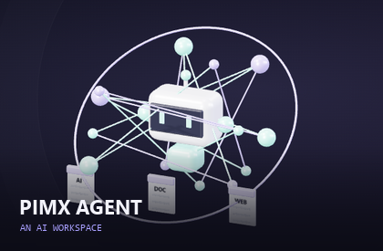
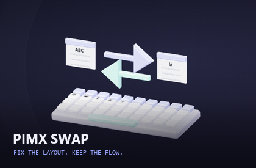
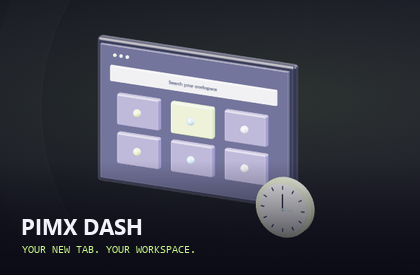
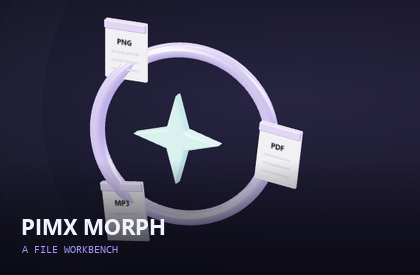
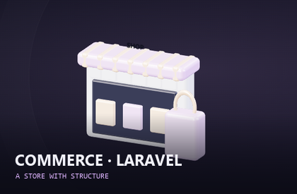

**[🇬🇧 English](README.md) · [🇮🇷 فارسی](README.fa.md)**

[🚀 PIMX](https://github.com/MOHAMMADREZAABEDINPOOR/PIMX) · [🗂️ مخزن‌ها](https://github.com/MOHAMMADREZAABEDINPOOR?tab=repositories&sort=updated)

# 👋 محمدرضا عابدین‌پور

سازندهٔ **PIMX**؛ ابزارهایی برای هوش مصنوعی، وب، دسکتاپ ویندوز و تلگرام می‌سازم. از اصلاح چیدمان کیبورد تا تبدیل فایل، برنامه‌ریزی شخصی و تجربه‌های سه‌بعدی، اینجا مسیر ورود به پروژه‌های من است.

## ✨ از اینجا شروع کن

|  |  |
|:---:|:---:|
|  |  |
|  |  |

## 🚀 پروژه‌های فعلی

پروژه‌های منتشرشدهٔ موجود در فضای کاری فعلی من. راهنمای کامل انگلیسی و فارسی هر پروژه داخل مخزن آن قرار دارد.

| پروژه | کاربرد | بخش |
|:---|:---|:---|
| 🧠 [PIMX AGENT](https://github.com/MOHAMMADREZAABEDINPOOR/PIMX_AGENT) | فضای کار هوش مصنوعی با Next.js، تنظیم سرویس‌دهندگان، گفتگو، پیوست، سازمان‌دهی پروژه و کتابخانه، پژوهش و ساخت سند و ارائه. | 🧠 هوش مصنوعی و ربات |
| ⌨️ [PIMX SWAP](https://github.com/MOHAMMADREZAABEDINPOOR/PIMX_SWAP) | ابزار محلی اصلاح چیدمان صفحه‌کلید ویندوز با Rust، Tauri 2، React و TypeScript؛ کلید فیزیکی متن را بازسازی و به چیدمان مقصد تبدیل می‌کند: `sghl` →… | 🧩 وب و ابزار |
| 🧩 [PIMX DASH](https://github.com/MOHAMMADREZAABEDINPOOR/PIMXDASH) | افزونه صفحه تب جدید Chrome و Chromium با Manifest V3، متمرکز بر نشانک، جست‌وجوی سریع، ابزار تمرکز و ویجت بهره‌وری. | 🧩 وب و ابزار |
| 🔄 [PIMX MORPH](https://github.com/MOHAMMADREZAABEDINPOOR/PIMX_MORPH) | میزکار تبدیل فایل در مرورگر برای تصویر، PDF، سند، صدا و داده ساخت‌یافته؛ هر تبدیل با تابع مستقل پیاده‌سازی شده است. | 🧩 وب و ابزار |
| 🎵 [PIMX SONIC · V2](https://github.com/MOHAMMADREZAABEDINPOOR/PIMX_SONIC_BOT_V2) | ربات رسانه تلگرام با TypeScript/Deno روی Supabase Edge Function؛ استخراج‌گرهای مستقل لینک YouTube، Instagram، X، SoundCloud و Spotify را پردازش… | 🧠 هوش مصنوعی و ربات |
| 🛍️ [COMMERCE · LARAVEL](https://github.com/MOHAMMADREZAABEDINPOOR/shop2) | فروشگاه Laravel 13 با Alpine.js و Tailwind، تنوع محصول، حساب مشتری، سبد، سفارش و عملیات مدیریتی مبتنی بر نقش. | 🛍️ فروشگاه |
| 📉 [PIMX FAIL](https://github.com/MOHAMMADREZAABEDINPOOR/PIMX_FAIL) | آرشیو قابل جست‌وجوی استارتاپ‌های شکست‌خورده با داستان شرکت‌ها، درس‌های شکست، طرح‌های فنی و تحلیل اختیاری با Gemini. | 🧩 وب و ابزار |
| 🔗 [PIMX NODE](https://github.com/MOHAMMADREZAABEDINPOOR/PIMX_NODE) | محیط انتقال فایل در مرورگر با کانال داده WebRTC، سرویس سیگنالینگ WebSocket در Node.js و رمزنگاری AES-GCM برای قطعه‌های فایل. | 🧩 وب و ابزار |
| 🎨 [PIMX MOJI](https://github.com/MOHAMMADREZAABEDINPOOR/PIMX_MOJI) | استودیوی تبدیل تصویر به هنر متنی در مرورگر؛ دارای سبک‌های آماده، انتخاب کاراکتر، پردازش Canvas، پیش‌نمایش و تاریخچه تبدیل. | 🧩 وب و ابزار |
| 🫥 [PIMX VEIL](https://github.com/MOHAMMADREZAABEDINPOOR/PIMX_VEIL) | میزکاری در مرورگر که داده را رمز می‌کند و همراه فراداده به انتهای فایل حامل می‌افزاید | 🔐 امنیت و شبکه |
| 🔐 [PIMX WIDE](https://github.com/MOHAMMADREZAABEDINPOOR/PIMX_WIDE) | رابط چندزبانه رمزنگاری متن و فایل با Web Crypto مرورگر، AES-256-GCM و کلید مشتق‌شده از گذرواژه، همراه سوابق محلی و ثبت اختیاری بازدید. | 🔐 امنیت و شبکه |
| 🌐 [PIMX PASS DNS](https://github.com/MOHAMMADREZAABEDINPOOR/PIMX_PASS_DNS) | رابط دوزبانه مقایسه DNS با منابع گردآوری‌شده، آزمون زمان پاسخ در مرورگر، کارت نتیجه و بک‌اند اختیاری آمار. | 🧩 وب و ابزار |
| 🛡️ [PIMX PASS PANEL](https://github.com/MOHAMMADREZAABEDINPOOR/PIMX_PASS_PANEL) | Worker در Cloudflare با رابط مدیریت فارسی، ذخیره وضعیت در KV، تولید اشتراک و اتصال پراکسی WebSocket به TCP. | 🔐 امنیت و شبکه |
| 🗓️ [PIMX PLANNER](https://github.com/MOHAMMADREZAABEDINPOOR/PIMX_PLANNER) | محیط برنامه‌ریزی شخصی با کارهای روزانه، اهداف، مطالعه، نمره‌ها، یادآوری، دفتر خاطرات و گفتگو | 🧩 وب و ابزار |
| 🎬 [PIMX ELTEX](https://github.com/MOHAMMADREZAABEDINPOOR/PIMX_ELTEX) | پلتفرم Next.js برای انتشار قسمت‌های ساخت پروژه با هوش مصنوعی، منابع کد و پیش‌نمایش، همراه حساب اعضا، نظرات و پنل مدیریت. | 🧠 هوش مصنوعی و ربات |
| 🚀 [PIMX](https://github.com/MOHAMMADREZAABEDINPOOR/PIMX) | وب‌سایت مجموعه PIMX؛ نمایش پروژه‌های مستقل وب، ابزارهای هوش مصنوعی و کارهای توسعه شخصی با React/TypeScript، سرور Node و توابع Pages. | 🧩 وب و ابزار |
| 💛 [PIMX SUPPORT](https://github.com/MOHAMMADREZAABEDINPOOR/PIMX_SUPPORT) | صفحه دوزبانه حمایت مالی از PIMX با کارت شبکه‌های رمزارزی، آدرس کیف پول و نمایش جزئیات به شکل رسید. | 🧩 وب و ابزار |
| 👨‍💻 [MOHAMMADREZA ABEDINPOOR](https://github.com/MOHAMMADREZAABEDINPOOR/personal-website) | وب‌سایت شخصی استاتیک با بخش پروژه‌ها، فایل گواهی‌ها، داده زبان‌ها، فراداده موتور جست‌وجو و Service Worker. | 🧩 وب و ابزار |
| 🚢 [TRADE & CONNECTION](https://github.com/MOHAMMADREZAABEDINPOOR/Import-Export-Company) | وب‌سایت چندصفحه‌ای شرکت واردات و صادرات با HTML، CSS و JavaScript؛ پوشه محلی پروژه `Mr.Amirhosseini` است. | 🧩 وب و ابزار |
| 🌤️ [PIMX WEATHER](https://github.com/MOHAMMADREZAABEDINPOOR/PIMX_WEATHER) | داشبورد آب‌وهوا با JavaScript ساده، پیش‌بینی، چندزبانه‌بودن، استایل متحرک و نمایش‌های نجومی و خورشیدی. | 🛰️ فضا |
| 📶 [PIMX PASS BOT](https://github.com/MOHAMMADREZAABEDINPOOR/PIMX_PASS_BOT) | ربات تلگرام و رابط وب همراه برای پیدا کردن، تجزیه و آزمون کانفیگ شبکه و سرور؛ ماژول‌های Python منابع، اسکن، ذخیره‌سازی و وب را جدا می‌کنند. | 🧠 هوش مصنوعی و ربات |
| 👛 [MML WALLET](https://github.com/MOHAMMADREZAABEDINPOOR/mml-wallet) | ربات کیف پول و جمع‌آوری در تلگرام با SQLite ناهمگام، تنظیم مدیریت، ابزار keep-alive و نمایشگر دیتابیس Flask. | 🧠 هوش مصنوعی و ربات |
| 🎮 [PIMX PLAY BOT](https://github.com/MOHAMMADREZAABEDINPOOR/PIMX_PLAY_BOT) | ربات Python تلگرام برای کشف برنامه با پرس‌وجوی منابع، تطبیق نتیجه، دکمه تعاملی و ارسال فایل موقت. | 🧠 هوش مصنوعی و ربات |
| 🎧 [PIMX SONIC](https://github.com/MOHAMMADREZAABEDINPOOR/PIMX_SONIC_BOT) | ربات موسیقی و رسانه تلگرام با Python، yt-dlp، HTTP ناهمگام، دکمه تعاملی و ابزار ذخیره‌سازی محلی. | 🧠 هوش مصنوعی و ربات |
| 📱 [PIMX CHAT PWA](https://github.com/MOHAMMADREZAABEDINPOOR/pwa-chatbot) | پروژه گفتگو با هوش مصنوعی در Node/Express، پوشه وب pimxchat، صفحات چندزبانه و ابزار ذخیره‌سازی SQLite. | 🧠 هوش مصنوعی و ربات |
| 📬 [TEMP MAIL STUDIO](https://github.com/MOHAMMADREZAABEDINPOOR/email-generator) | ابزار ترمینال برای ساخت صندوق موقت با temp-mail.io، پایش پیام با نخ پس‌زمینه و استخراج کدهای احتمالی تأیید. | 🧠 هوش مصنوعی و ربات |
| 🛒 [COMMERCE · DJANGO](https://github.com/MOHAMMADREZAABEDINPOOR/shop) | فروشگاه Django با تنوع محصول، سبد مهمان و مشتری، ثبت سفارش با کنترل موجودی، شبیه‌ساز پرداخت محلی و داشبورد عملیات. | 🛍️ فروشگاه |
| 📦 [COMMERCE · PHP](https://github.com/MOHAMMADREZAABEDINPOOR/shop3) | فروشگاه PHP بدون فریم‌ورک با لایه کوچک MVC و روتر، راه‌اندازی SQLite، صفحات مشتری و مدیر و محتوای دوزبانه محصول. | 🛍️ فروشگاه |
| ✨ [GEMINI TELEGRAM BOT](https://github.com/MOHAMMADREZAABEDINPOOR/telegram-bot) | ربات کوچک تلگرام با long polling که متن کاربر را به REST API جمنای می‌فرستد و پرامپت ثابت را از فایل متنی می‌خواند. | 🧠 هوش مصنوعی و ربات |

## 🧰 ابزارهای من

## 🌌 پروژه‌های دیگر

| پروژه | کاربرد |
|:---|:---|
| 🛰️ [PIMX SATS](https://github.com/MOHAMMADREZAABEDINPOOR/PIMXSATS) | کاوشگر تعاملی ماهواره‌ها و منظومه شمسی؛ کره سه‌بعدی، محاسبه مدار با satellite.js و پیش‌بینی گذر ماهواره‌ها، داده‌های مداری را به یک محیط دیداری تبدیل می‌کنند. |
| 📡 [PIMX PERSONAL](https://github.com/MOHAMMADREZAABEDINPOOR/PIMX_PERSONAL) | داشبورد React برای کشف سرور با بک‌اند Node جهت جمع‌آوری، آزمایش و نمایش کانفیگ‌های سرور و پراکسی؛ کاربرد کد یک ابزار شبکه است. |
| 🌀 [PIMX PORTAL](https://github.com/MOHAMMADREZAABEDINPOOR/PIMX_PORTAL) | فهرست تصویری دوزبانه مجموعه PIMX؛ پوسترهای اختصاصی، بازدیدکننده را به ابزارها و بخش حمایت هدایت می‌کنند. |
| 🪐 [SPATIAL PORTFOLIO](https://github.com/MOHAMMADREZAABEDINPOOR/3d-animated-interactive-portfolio) | نمونه‌کار شخصی با فرانت‌اند React Three Fiber و API پروژه در Express؛ صحنه‌های Three.js و حرکت Framer Motion به نمایش پروژه‌ها شکل می‌دهند. |
| 🏙️ [TEHRAN](https://github.com/MOHAMMADREZAABEDINPOOR/Tehran) | وب‌سایت استاتیک فرهنگی و رسانه‌ای با صفحات محتوایی، ویدیوی جاسازی‌شده و پوسته تیره. |
| 🤖 [PIMX EDGE BOT](https://github.com/MOHAMMADREZAABEDINPOOR/BOT) | دستیار هوش مصنوعی تلگرام به شکل Cloudflare Worker با مسیریابی سرویس‌دهنده، حافظه گفتگو، یادآوری و ابزار منطقه زمانی کاربر. |
| 🏡 [PROPERTY DISCOVERY BOT](https://github.com/MOHAMMADREZAABEDINPOOR/telegram-web-scraping-bot) | مجموعه اسکریپت تلگرام و عامل برای کشف آگهی ملک با اتصال Agno/Gemini و ابزار استخراج Scrapling. |
| 💬 [PIMX CHAT · DJANGO](https://github.com/MOHAMMADREZAABEDINPOOR/chat) | برنامه گفتگو با Django، مدیریت حساب، ذخیره مکالمه، فایل استاتیک و اتصال پاسخ هوش مصنوعی. |

🎓 آرشیو یادگیری و تمرین‌های قدیمی

این مخزن‌ها مسیر یادگیری من را ثبت می‌کنند؛ تمرکز این صفحه روی پروژه‌های فعلی بالاست.

| مخزن | موضوع |
|:---|:---|
| 🎲 [gussing-number](https://github.com/MOHAMMADREZAABEDINPOOR/gussing-number) | بازی حدس عدد در کنسول که عددی از ۱ تا ۱۰ انتخاب و بهترین تعداد تلاش را در نشست فعلی ثبت می‌کند. |
| 🎯 [gussing-number-with-js](https://github.com/MOHAMMADREZAABEDINPOOR/gussing-number-with-js) | بازی کوچک مرورگر با عدد تصادفی ۰ تا ۹۹۹، راهنمای بیشتر و کمتر و ده فرصت حدس اشتباه. |
| 🕰️ [clock](https://github.com/MOHAMMADREZAABEDINPOOR/clock) | ساعت دیجیتال Tkinter که برچسب زمان را هر ۲۰۰ میلی‌ثانیه تازه می‌کند. |
| ♟️ [chess-timer-with-python](https://github.com/MOHAMMADREZAABEDINPOOR/chess-timer-with-python) | تمرین Tkinter با شمارنده مستقل بازیکنان و دکمه جابه‌جایی نوبت. |
| 🌡️ [temperuture](https://github.com/MOHAMMADREZAABEDINPOOR/temperuture) | کنترل‌کننده شبیه‌سازی‌شده دما با افزایش و کاهش و وضعیت بخاری و کولر. |
| 🌡️ [thermometer](https://github.com/MOHAMMADREZAABEDINPOOR/thermometer) | کلاس دماسنج قابل استفاده مجدد Tkinter با نمایش دو پنل مستقل. |
| ⏳ [time-with-tkinter-library](https://github.com/MOHAMMADREZAABEDINPOOR/time-with-tkinter-library) | تمرین شمارش معکوس Tkinter با ورودی ساعت، دقیقه و ثانیه و پیام پایان. |
| ⏱️ [timer-with-threading-library](https://github.com/MOHAMMADREZAABEDINPOOR/timer-with-threading-library) | تمرین Tkinter و threading با دو شمارنده معکوس قابل شروع مستقل. |
| 🪟 [open-random-window](https://github.com/MOHAMMADREZAABEDINPOOR/open-random-window) | آزمایش کوچک Tkinter که ده پنجره با اندازه و موقعیت تصادفی می‌سازد. |
| 🐢 [turtle-library](https://github.com/MOHAMMADREZAABEDINPOOR/turtle-library) | مجموعه اسکریپت مقدماتی Python؛ یک تمرین ورودی کنسول و پنج طراحی Turtle با تکرار حرکت و چرخش. |
| 📝 [c-mn](https://github.com/MOHAMMADREZAABEDINPOOR/c-mn) | برنامه کنسولی C++ که واژه‌ها را می‌خواند و تا ورود exit هر مقدار را در فایل می‌نویسد. |
| 🧮 [my-project](https://github.com/MOHAMMADREZAABEDINPOOR/my-project) | تمرین اولیه ورودی و خروجی C++؛ عدد صحیح تا صفر می‌خواند، مقدار غیرصفر را می‌نویسد و تعداد ورودی را چاپ می‌کند. |
| 🔢 [cpp](https://github.com/MOHAMMADREZAABEDINPOOR/cpp) | برنامه C++ که ماتریس صحیح ۳ در ۳ می‌خواند، ستون‌ها را در آرایه جدا می‌کند و به‌ترتیب چاپ می‌کند. |
| 📒 [exam](https://github.com/MOHAMMADREZAABEDINPOOR/exam) | تمرین forkشده C++ برای ورودی نام کاربری و ذخیره در فایل؛ به‌عنوان نسخه آموزشی با اشاره به منبع نگه داشته شده است. |
| 🗄️ [sqlalchemy](https://github.com/MOHAMMADREZAABEDINPOOR/sqlalchemy) | چهار تمرین Python ORM، درج، خواندن، تغییر و حذف ردیف در جدول MySQL را نشان می‌دهند. |
| 🖱️ [spam-with-pyautogui](https://github.com/MOHAMMADREZAABEDINPOOR/spam-with-pyautogui) | آزمایش کوتاه PyAutoGUI که پس از مکث، رشته ثابتی از کلیدهای ویندوز را ارسال می‌کند. |
| 🎓 [coursera](https://github.com/MOHAMMADREZAABEDINPOOR/coursera) | مجموعه کوچک تمرین دوره HTML/CSS با صفحه ریشه و پوشه module3-solution. |
| 🌱 [test](https://github.com/MOHAMMADREZAABEDINPOOR/test) | مخزن تکلیف دوره با محاسبه بهره ساده در Shell و فایل مشارکت و قواعد جامعه. |
| 🍴 [mcino-Introduction-to-Git-and-GitHub](https://github.com/MOHAMMADREZAABEDINPOOR/mcino-Introduction-to-Git-and-GitHub) | مخزن forkشده تمرین Git و GitHub با محاسبه بهره و اسناد جامعه منبع اصلی. |
| 📚 [Web-Application-Technologies-and-Django-Coursera](https://github.com/MOHAMMADREZAABEDINPOOR/Web-Application-Technologies-and-Django-Coursera) | آرشیو forkشده محتوای دوره Web Application Technologies and Django در پوشه‌های هفته ۱ تا ۵. |

## 🤝 ارتباط و مشارکت

برای پیشنهاد یا گزارش مشکل، issue مخزن مربوط را باز کن. برای حمایت از مجموعه، [PIMX SUPPORT](https://github.com/MOHAMMADREZAABEDINPOOR/PIMX_SUPPORT) را ببین.

---

**⚡ Build. Learn. Refine.** · [English](README.md) · [فارسی](README.fa.md) · [Static artwork](assets/readme/hero.png)

