

**[🌐 English](README.md) · [🇮🇷 فارسی](README.fa.md)**

[✨ پروژه‌های منتخب](#featured) · [🚀 پروژه‌های فعلی](#current) · [🧰 فناوری‌ها](#toolkit) · [🤝 ارتباط](#connect)

# 👋 سلام، من محمدرضا عابدین‌پورم.

سازندهٔ **PIMX**؛ ایده‌هایم را به ابزارهایی برای **هوش مصنوعی، وب، ویندوز و تلگرام** تبدیل می‌کنم. از اصلاح یک متن با چیدمان اشتباه تا ساخت یک محیط پژوهش یا نمایش مدار ماهواره، دوست دارم نرم‌افزار هم کاربرد داشته باشد و هم شخصیت.

## 🌌 سه مسیر، یک مجموعه

|  **🧠 هوشمندی** فضاهای کاری هوش مصنوعی، گفتگو، پژوهش و خروجی کاربردی. |  **⌨️ ساخت ابزار** ابزار مرورگر، برنامه ویندوز و محصولاتی برای کارهای روزمره. |  **🛰️ کاوش** داده مداری، آب‌وهوا، تجربه‌های دیداری و جهان‌های سه‌بعدی. |
|:---:|:---:|:---:|

## ✨ پروژه‌های منتخب

**۲۰ سایت و محیط وب آنلاین روی Cloudflare.** روی هر کارت کلیک کن تا مستقیم وارد سایت شوی و از آن استفاده کنی؛ لینک سورس مخزن‌های عمومی هم زیر کارت آمده است.

|  **PIMX AGENT / CHAT** ورود به فضای کاری هوش مصنوعی برای گفتگو، پژوهش و ساخت. <a href="https://chat.pimxagent.pages.dev">🌐 ورود به سایت</a> · <a href="https://github.com/MOHAMMADREZAABEDINPOOR/PIMX_AGENT">💻 سورس</a> |  **PIMX AGENT** آشنایی با PIMX Agent، قابلیت‌ها و فضای کاری آن. <a href="https://pimxagent.pages.dev">🌐 ورود به سایت</a> · <a href="https://github.com/MOHAMMADREZAABEDINPOOR/PIMX_AGENT">💻 سورس</a> |
|:---:|:---:|
| <a href="https://pimxagent.mohammadrezaabedinpoor6.workers.dev">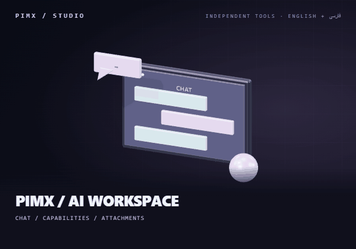</a> **PIMX / AI WORKSPACE** محیط گفتگو در مرورگر، انتخاب قابلیت‌ها و پیوست فایل. <a href="https://pimxagent.mohammadrezaabedinpoor6.workers.dev">🌐 ورود به سایت</a> |  **PIMX MORPH** تبدیل فایل با روند انتخاب و تبدیل فرمت در مرورگر. <a href="https://pimxmorph.pages.dev">🌐 ورود به سایت</a> · <a href="https://github.com/MOHAMMADREZAABEDINPOOR/PIMX_MORPH">💻 سورس</a> |
| <a href="https://pimxmoji.pages.dev">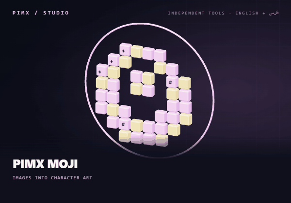</a> **PIMX MOJI** تبدیل تصویر به هنر ASCII، ایموجی و موزاییک کاراکتری. <a href="https://pimxmoji.pages.dev">🌐 ورود به سایت</a> · <a href="https://github.com/MOHAMMADREZAABEDINPOOR/PIMX_MOJI">💻 سورس</a> | <a href="https://pimxnode.pages.dev">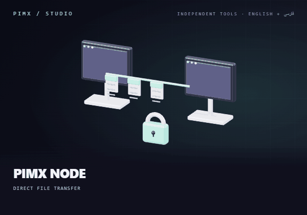</a> **PIMX NODE** ورود به محیط انتقال مستقیم فایل بین مرورگرها. <a href="https://pimxnode.pages.dev">🌐 ورود به سایت</a> · <a href="https://github.com/MOHAMMADREZAABEDINPOOR/PIMX_NODE">💻 سورس</a> |
| <a href="https://pimxveil.pages.dev">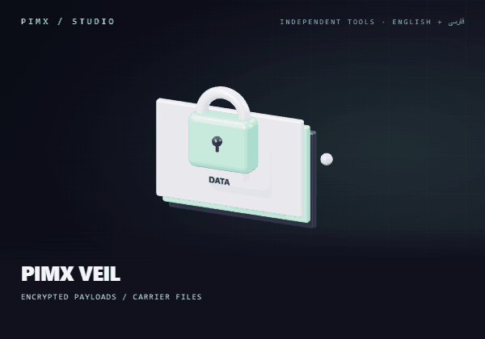</a> **PIMX VEIL** رمزنگاری محتوای داده و قرار دادن آن در فایل حامل. <a href="https://pimxveil.pages.dev">🌐 ورود به سایت</a> · <a href="https://github.com/MOHAMMADREZAABEDINPOOR/PIMX_VEIL">💻 سورس</a> | <a href="https://pimxwide.pages.dev">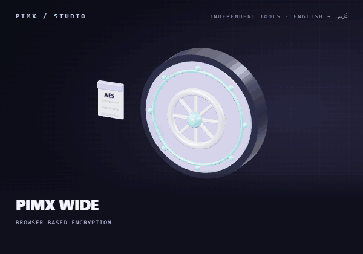</a> **PIMX WIDE** رمزنگاری و رمزگشایی متن و فایل در مرورگر. <a href="https://pimxwide.pages.dev">🌐 ورود به سایت</a> · <a href="https://github.com/MOHAMMADREZAABEDINPOOR/PIMX_WIDE">💻 سورس</a> |
| <a href="https://pimxpassdns.pages.dev">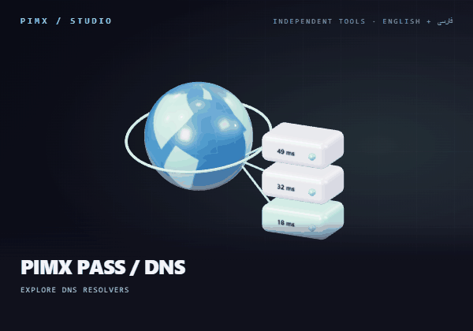</a> **PIMX PASS / DNS** کاوش سرویس‌های DNS و مقایسهٔ زمان پاسخ در مرورگر. <a href="https://pimxpassdns.pages.dev">🌐 ورود به سایت</a> · <a href="https://github.com/MOHAMMADREZAABEDINPOOR/PIMX_PASS_DNS">💻 سورس</a> | <a href="https://pimxsats.pages.dev">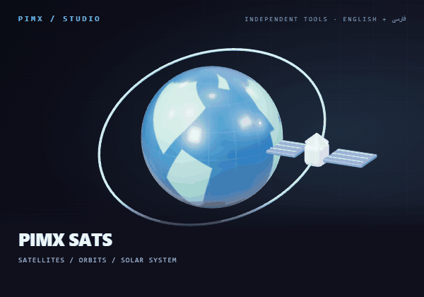</a> **PIMX SATS** کاوش ماهواره‌ها، گذرهای مداری و منظومهٔ شمسی. <a href="https://pimxsats.pages.dev">🌐 ورود به سایت</a> · <a href="https://github.com/MOHAMMADREZAABEDINPOOR/PIMXSATS">💻 سورس</a> |
| <a href="https://pimx-weather.pages.dev">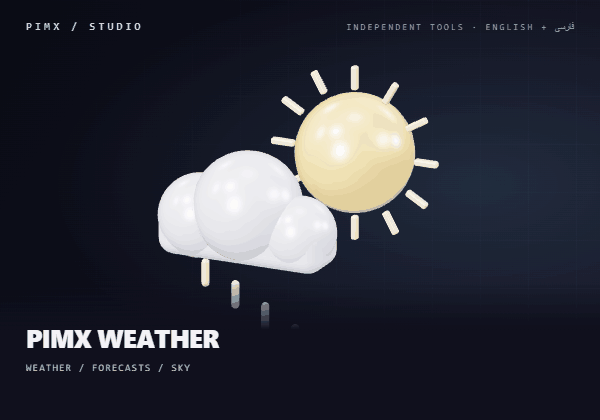</a> **PIMX WEATHER** داشبورد تصویری آب‌وهوا، پیش‌بینی و نماهای آسمان. <a href="https://pimx-weather.pages.dev">🌐 ورود به سایت</a> · <a href="https://github.com/MOHAMMADREZAABEDINPOOR/PIMX_WEATHER">💻 سورس</a> | <a href="https://pimxfail.pages.dev">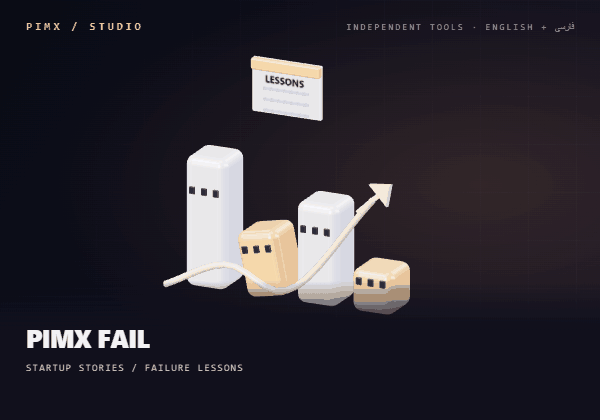</a> **PIMX FAIL** مرور داستان استارتاپ‌ها، درس‌های شکست و طرح‌های فنی. <a href="https://pimxfail.pages.dev">🌐 ورود به سایت</a> · <a href="https://github.com/MOHAMMADREZAABEDINPOOR/PIMX_FAIL">💻 سورس</a> |
| <a href="https://pimxeltex.pages.dev">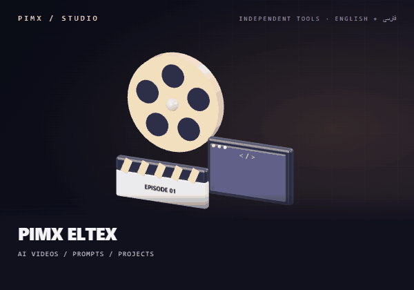</a> **PIMX ELTEX** کاوش ویدئوهای هوش مصنوعی، پرامپت‌ها و پروژه‌های ساخت سایت. <a href="https://pimxeltex.pages.dev">🌐 ورود به سایت</a> · <a href="https://github.com/MOHAMMADREZAABEDINPOOR/PIMX_ELTEX">💻 سورس</a> · <a href="https://pimx-eltex.mohammadrezaabedinpoor6.workers.dev">Workers</a> | <a href="https://pimxportal.pages.dev">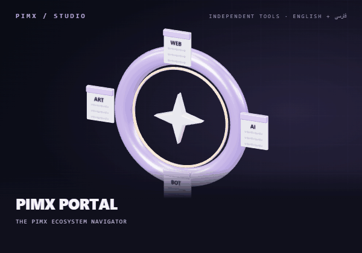</a> **PIMX PORTAL** کشف ابزارهای آنلاین PIMX از یک راهنمای مشترک. <a href="https://pimxportal.pages.dev">🌐 ورود به سایت</a> · <a href="https://github.com/MOHAMMADREZAABEDINPOOR/PIMX_PORTAL">💻 سورس</a> |
| <a href="https://pimx.pages.dev">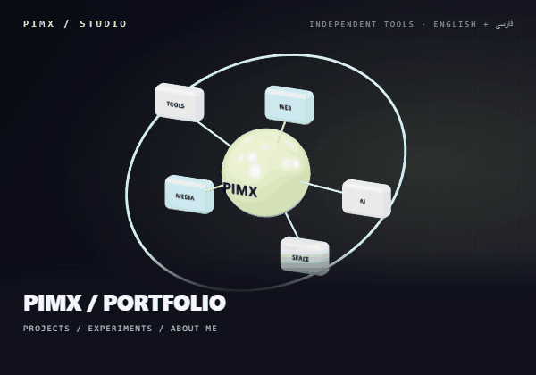</a> **PIMX / PORTFOLIO** پورتفولیوی من؛ پروژه‌ها، تجربه‌ها و داستان ساخت PIMX. <a href="https://pimx.pages.dev">🌐 ورود به سایت</a> · <a href="https://github.com/MOHAMMADREZAABEDINPOOR/PIMX">💻 سورس</a> | <a href="https://amirhosseini.pages.dev">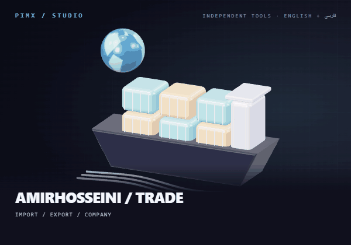</a> **AMIRHOSSEINI / TRADE** وب‌سایت شرکتی برای معرفی خدمات واردات و صادرات. <a href="https://amirhosseini.pages.dev">🌐 ورود به سایت</a> · <a href="https://github.com/MOHAMMADREZAABEDINPOOR/Import-Export-Company">💻 سورس</a> |
| <a href="https://iamtehran.pages.dev">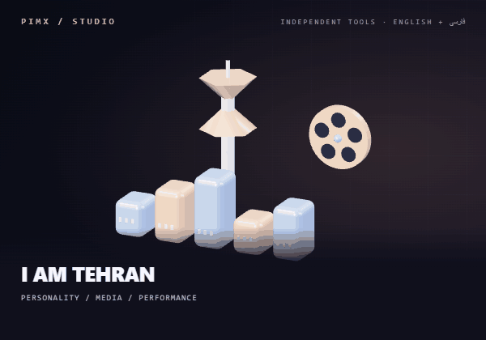</a> **I AM TEHRAN** وب‌سایت شخصی تهران برای معرفی، رسانه و فعالیت‌های او. <a href="https://iamtehran.pages.dev">🌐 ورود به سایت</a> · <a href="https://github.com/MOHAMMADREZAABEDINPOOR/Tehran">💻 سورس</a> | <a href="https://soheileghtesadi.pages.dev">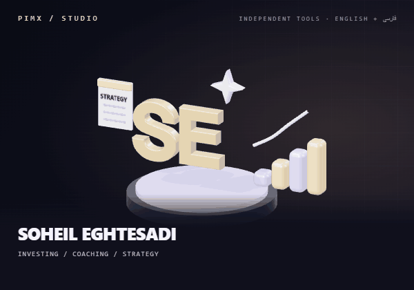</a> **SOHEIL EGHTESADI** وب‌سایت شخصی برای سرمایه‌گذاری، کوچینگ کسب‌وکار و استراتژی بازاریابی. <a href="https://soheileghtesadi.pages.dev">🌐 ورود به سایت</a> |
| <a href="https://soheileghtesadiportal.pages.dev">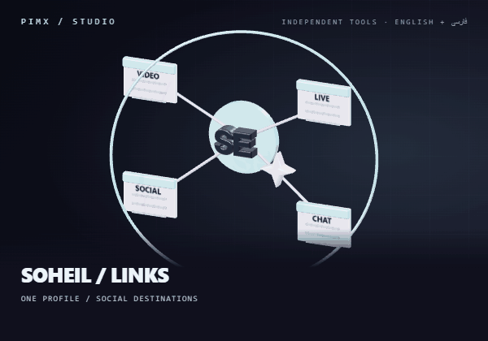</a> **SOHEIL / LINKS** درگاه دو زبانهٔ لینک‌ها و کانال‌های اجتماعی سهیل. <a href="https://soheileghtesadiportal.pages.dev">🌐 ورود به سایت</a> | <a href="https://caspianar.pages.dev">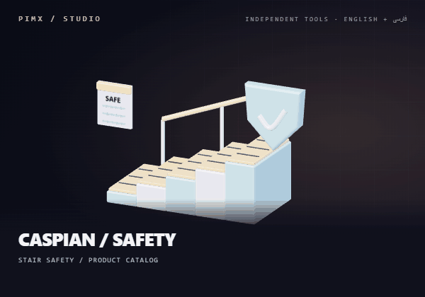</a> **CASPIAN / SAFETY** وب‌سایت ایمن قدم کاسپین؛ معرفی ترمز پله و تجهیزات ایمنی. <a href="https://caspianar.pages.dev">🌐 ورود به سایت</a> |

### ⌨️ PIMX SWAP — دانلود و نصب روی ویندوز

`sghl` را به `سلام` تبدیل کن؛ با اصلاح چیدمان کلیدها، به‌صورت محلی روی ویندوز. **[دانلود فایل نصب](https://github.com/MOHAMMADREZAABEDINPOOR/PIMX_SWAP/releases/latest)** — نصب کن، چیدمان‌ها را انتخاب کن و از میانبرها استفاده کن. مصرف رم در اندازه‌گیری محلی حالت پس‌زمینه، با ویرایشگر بسته، حدود **۱۳ MiB** بود؛ جزئیات در README پروژه آمده است.

## 🛠️ از ایده تا ساخت

| مرحله | چیزی که برایم مهم است |
|:---|:---|
| 💡 ایده | شروع با یک مسئله یا موضوعی که ارزش کاوش دارد. |
| 🎨 طراحی | هماهنگی روند استفاده با هویت بصری. |
| 🧑‍💻 ساخت | انتخاب فناوری مناسب مرورگر، دسکتاپ، ربات یا بک‌اند. |
| 🔁 بهبود | بهبود رفتار و قابل‌فهم‌تر کردن پروژه. |

## 📊 ردپای ساختن

فعالیت عمومی واقعی این حساب از ۸ اکتبر ۲۰۲۵ تا ۷ اکتبر ۲۰۲۶؛ هر ستون یک روز است و ارتفاع آن شدت فعالیت را نشان می‌دهد. این تصویر یک snapshot در تاریخ **۷ اکتبر ۲۰۲۶** است.

## 🧰 فناوری‌هایی که با آن‌ها می‌سازم

این‌ها فناوری‌هایی‌اند که در کد پروژه‌های این مجموعه استفاده شده‌اند.

| حوزه | ابزارها | نمونه |
|:---|:---|:---|
| 🎨 رابط کاربری | TypeScript · React · Next.js · Vite · Tailwind CSS | [PIMX DASH](https://github.com/MOHAMMADREZAABEDINPOOR/PIMXDASH) |
| 🖥️ دسکتاپ | Rust · Tauri · Windows APIs | [PIMX SWAP](https://github.com/MOHAMMADREZAABEDINPOOR/PIMX_SWAP) |
| ⚙️ سرویس‌ها | Node.js · Express · Python · Django · PHP · Laravel | [SHOP 02 / LARAVEL](https://github.com/MOHAMMADREZAABEDINPOOR/shop2) |
| ☁️ لبه و ربات | Cloudflare Workers · Deno · Supabase · Telegram | [PIMX SONIC · V2](https://github.com/MOHAMMADREZAABEDINPOOR/PIMX_SONIC_BOT_V2) |
| 🗄️ داده | SQLite · PostgreSQL · Cloudflare D1 | [PIMX PLANNER](https://github.com/MOHAMMADREZAABEDINPOOR/PIMX_PLANNER) |
| 🪐 قابلیت مرورگر | Three.js · Canvas · WebRTC · Web Crypto | [PIMX NODE](https://github.com/MOHAMMADREZAABEDINPOOR/PIMX_NODE) |

## 🚀 فهرست پروژه‌های فعلی

پروژه‌های منتشرشدهٔ فضای کاری فعلی؛ هر مخزن راهنمای کامل انگلیسی و فارسی دارد.

| پروژه | کاربرد |
|:---|:---|
| 🧠 [PIMX AGENT](https://github.com/MOHAMMADREZAABEDINPOOR/PIMX_AGENT) | فضای کاری هوش مصنوعی برای گفتگو، پژوهش و کار با اسناد. |
| ⌨️ [PIMX SWAP](https://github.com/MOHAMMADREZAABEDINPOOR/PIMX_SWAP) | اصلاح محلی متن تایپ‌شده با چیدمان اشتباه در ویندوز. |
| 🧩 [PIMX DASH](https://github.com/MOHAMMADREZAABEDINPOOR/PIMXDASH) | فضای کاری تب جدید برای نشانک‌ها، جست‌وجو و تمرکز. |
| 🔄 [PIMX MORPH](https://github.com/MOHAMMADREZAABEDINPOOR/PIMX_MORPH) | تبدیل تصویر، PDF، سند، صوت و داده ساخت‌یافته. |
| 🎵 [PIMX SONIC · V2](https://github.com/MOHAMMADREZAABEDINPOOR/PIMX_SONIC_BOT_V2) | ربات دریافت رسانه در تلگرام با Supabase Edge Function. |
| 🛍️ [SHOP 02 / LARAVEL](https://github.com/MOHAMMADREZAABEDINPOOR/shop2) | فروشگاه Laravel با تنوع محصول، سبد خرید و مدیریت نقش‌ها. |
| 📉 [PIMX FAIL](https://github.com/MOHAMMADREZAABEDINPOOR/PIMX_FAIL) | کاوش استارتاپ‌های شکست‌خورده، داستان‌ها و درس‌های آن‌ها. |
| 🔗 [PIMX NODE](https://github.com/MOHAMMADREZAABEDINPOOR/PIMX_NODE) | انتقال رمزنگاری‌شده فایل بین مرورگرها با WebRTC. |
| 🎨 [PIMX MOJI](https://github.com/MOHAMMADREZAABEDINPOOR/PIMX_MOJI) | تبدیل تصویر به هنر کاراکتری در مرورگر. |
| 🫥 [PIMX VEIL](https://github.com/MOHAMMADREZAABEDINPOOR/PIMX_VEIL) | رمزنگاری محتوای داده و افزودن آن به فایل حامل. |
| 🔐 [PIMX WIDE](https://github.com/MOHAMMADREZAABEDINPOOR/PIMX_WIDE) | رمزنگاری متن و فایل در مرورگر با Web Crypto. |
| 🌐 [PIMX PASS DNS](https://github.com/MOHAMMADREZAABEDINPOOR/PIMX_PASS_DNS) | مقایسه سرویس‌های DNS با آزمون زمان‌بندی مرورگر. |
| 🛡️ [PIMX PASS PANEL](https://github.com/MOHAMMADREZAABEDINPOOR/PIMX_PASS_PANEL) | مدیریت پراکسی Cloudflare Worker و اشتراک‌ها. |
| 🗓️ [PIMX PLANNER](https://github.com/MOHAMMADREZAABEDINPOOR/PIMX_PLANNER) | محیط کارها، هدف‌ها، پیگیری مطالعه و دفتر روزانه. |
| 🎬 [PIMX ELTEX](https://github.com/MOHAMMADREZAABEDINPOOR/PIMX_ELTEX) | انتشار مراحل ساخت با هوش مصنوعی، کد و پیش‌نمایش پروژه. |
| 🚀 [PIMX](https://github.com/MOHAMMADREZAABEDINPOOR/PIMX) | خانه ابزارهای مستقل در مجموعه PIMX. |
| 💛 [PIMX SUPPORT](https://github.com/MOHAMMADREZAABEDINPOOR/PIMX_SUPPORT) | صفحه دو زبانه حمایت مالی از مجموعه. |
| 👨‍💻 [PERSONAL WEBSITE](https://github.com/MOHAMMADREZAABEDINPOOR/personal-website) | وب‌سایت شخصی با پروژه‌ها، گواهی‌ها و محتوای چندزبانه. |
| 🚢 [IMPORT / EXPORT](https://github.com/MOHAMMADREZAABEDINPOOR/Import-Export-Company) | وب‌سایت چندصفحه‌ای شرکت واردات و صادرات. |
| 🌤️ [PIMX WEATHER](https://github.com/MOHAMMADREZAABEDINPOOR/PIMX_WEATHER) | آب‌وهوا، پیش‌بینی و نمایش‌های نجومی. |
| 📶 [PIMX PASS BOT](https://github.com/MOHAMMADREZAABEDINPOOR/PIMX_PASS_BOT) | ابزار تلگرامی یافتن و بررسی پیکربندی‌های شبکه. |
| 👛 [MML WALLET](https://github.com/MOHAMMADREZAABEDINPOOR/mml-wallet) | روند کیف پول تلگرامی با ذخیره‌سازی SQLite. |
| 🎮 [PIMX PLAY BOT](https://github.com/MOHAMMADREZAABEDINPOOR/PIMX_PLAY_BOT) | کشف برنامه‌ها و مرور نتایج در تلگرام. |
| 🎧 [PIMX SONIC](https://github.com/MOHAMMADREZAABEDINPOOR/PIMX_SONIC_BOT) | ربات موسیقی و رسانه تلگرام با Python. |
| 📱 [PIMX CHAT PWA](https://github.com/MOHAMMADREZAABEDINPOOR/pwa-chatbot) | فضای گفتگو با Node/Express و صفحات وب چندزبانه. |
| 📬 [EMAIL GENERATOR](https://github.com/MOHAMMADREZAABEDINPOOR/email-generator) | ساخت ایمیل موقت، پایش پیام‌ها و استخراج کدها. |
| 🛒 [SHOP / DJANGO](https://github.com/MOHAMMADREZAABEDINPOOR/shop) | فروشگاه Django با سبد، سفارش متناسب با موجودی و پرداخت آزمایشی. |
| 📦 [SHOP 03 / PHP](https://github.com/MOHAMMADREZAABEDINPOOR/shop3) | فروشگاه سبک PHP/SQLite با صفحات مشتری و مدیر. |
| ✨ [TELEGRAM / GEMINI](https://github.com/MOHAMMADREZAABEDINPOOR/telegram-bot) | دستیار ساده تلگرام متصل به Gemini. |

🌠 مسیرهای دیگر در جهان PIMX

| پروژه | موضوع |
|:---|:---|
| 🛰️ [PIMX SATS](https://github.com/MOHAMMADREZAABEDINPOOR/PIMXSATS) | کاوشگر تعاملی ماهواره‌ها و منظومه شمسی؛ کره سه‌بعدی، محاسبه مدار با satellite.js و پیش‌بینی گذر ماهواره‌ها، داده‌های مداری را به یک محیط دیداری تبدیل می‌کنند. |
| 📡 [PIMX PERSONAL](https://github.com/MOHAMMADREZAABEDINPOOR/PIMX_PERSONAL) | داشبورد React برای کشف سرور با بک‌اند Node جهت جمع‌آوری، آزمایش و نمایش کانفیگ‌های سرور و پراکسی؛ کاربرد کد یک ابزار شبکه است. |
| 🌀 [PIMX PORTAL](https://github.com/MOHAMMADREZAABEDINPOOR/PIMX_PORTAL) | فهرست تصویری دوزبانه مجموعه PIMX؛ پوسترهای اختصاصی، بازدیدکننده را به ابزارها و بخش حمایت هدایت می‌کنند. |
| 🪐 [SPATIAL PORTFOLIO](https://github.com/MOHAMMADREZAABEDINPOOR/3d-animated-interactive-portfolio) | نمونه‌کار شخصی با فرانت‌اند React Three Fiber و API پروژه در Express؛ صحنه‌های Three.js و حرکت Framer Motion به نمایش پروژه‌ها شکل می‌دهند. |
| 🏙️ [TEHRAN](https://github.com/MOHAMMADREZAABEDINPOOR/Tehran) | وب‌سایت استاتیک فرهنگی و رسانه‌ای با صفحات محتوایی، ویدیوی جاسازی‌شده و پوسته تیره. |
| 🤖 [PIMX EDGE BOT](https://github.com/MOHAMMADREZAABEDINPOOR/BOT) | دستیار هوش مصنوعی تلگرام به شکل Cloudflare Worker با مسیریابی سرویس‌دهنده، حافظه گفتگو، یادآوری و ابزار منطقه زمانی کاربر. |
| 🏡 [PROPERTY DISCOVERY BOT](https://github.com/MOHAMMADREZAABEDINPOOR/telegram-web-scraping-bot) | مجموعه اسکریپت تلگرام و عامل برای کشف آگهی ملک با اتصال Agno/Gemini و ابزار استخراج Scrapling. |
| 💬 [PIMX CHAT · DJANGO](https://github.com/MOHAMMADREZAABEDINPOOR/chat) | برنامه گفتگو با Django، مدیریت حساب، ذخیره مکالمه، فایل استاتیک و اتصال پاسخ هوش مصنوعی. |

🎓 آرشیو یادگیری و پروژه‌های قدیمی

تمرین‌هایی که مسیر یادگیری من را ثبت کرده‌اند؛ از Python و C++ تا پایگاه داده، وب و Git.

| مخزن | موضوع |
|:---|:---|
| 🎲 [gussing-number](https://github.com/MOHAMMADREZAABEDINPOOR/gussing-number) | بازی حدس عدد در کنسول که عددی از ۱ تا ۱۰ انتخاب و بهترین تعداد تلاش را در نشست فعلی ثبت می‌کند. |
| 🎯 [gussing-number-with-js](https://github.com/MOHAMMADREZAABEDINPOOR/gussing-number-with-js) | بازی کوچک مرورگر با عدد تصادفی ۰ تا ۹۹۹، راهنمای بیشتر و کمتر و ده فرصت حدس اشتباه. |
| 🕰️ [clock](https://github.com/MOHAMMADREZAABEDINPOOR/clock) | ساعت دیجیتال Tkinter که برچسب زمان را هر ۲۰۰ میلی‌ثانیه تازه می‌کند. |
| ♟️ [chess-timer-with-python](https://github.com/MOHAMMADREZAABEDINPOOR/chess-timer-with-python) | تمرین Tkinter با شمارنده مستقل بازیکنان و دکمه جابه‌جایی نوبت. |
| 🌡️ [temperuture](https://github.com/MOHAMMADREZAABEDINPOOR/temperuture) | کنترل‌کننده شبیه‌سازی‌شده دما با افزایش و کاهش و وضعیت بخاری و کولر. |
| 🌡️ [thermometer](https://github.com/MOHAMMADREZAABEDINPOOR/thermometer) | کلاس دماسنج قابل استفاده مجدد Tkinter با نمایش دو پنل مستقل. |
| ⏳ [time-with-tkinter-library](https://github.com/MOHAMMADREZAABEDINPOOR/time-with-tkinter-library) | تمرین شمارش معکوس Tkinter با ورودی ساعت، دقیقه و ثانیه و پیام پایان. |
| ⏱️ [timer-with-threading-library](https://github.com/MOHAMMADREZAABEDINPOOR/timer-with-threading-library) | تمرین Tkinter و threading با دو شمارنده معکوس قابل شروع مستقل. |
| 🪟 [open-random-window](https://github.com/MOHAMMADREZAABEDINPOOR/open-random-window) | آزمایش کوچک Tkinter که ده پنجره با اندازه و موقعیت تصادفی می‌سازد. |
| 🐢 [turtle-library](https://github.com/MOHAMMADREZAABEDINPOOR/turtle-library) | مجموعه اسکریپت مقدماتی Python؛ یک تمرین ورودی کنسول و پنج طراحی Turtle با تکرار حرکت و چرخش. |
| 📝 [c-mn](https://github.com/MOHAMMADREZAABEDINPOOR/c-mn) | برنامه کنسولی C++ که واژه‌ها را می‌خواند و تا ورود exit هر مقدار را در فایل می‌نویسد. |
| 🧮 [my-project](https://github.com/MOHAMMADREZAABEDINPOOR/my-project) | تمرین اولیه ورودی و خروجی C++؛ عدد صحیح تا صفر می‌خواند، مقدار غیرصفر را می‌نویسد و تعداد ورودی را چاپ می‌کند. |
| 🔢 [cpp](https://github.com/MOHAMMADREZAABEDINPOOR/cpp) | برنامه C++ که ماتریس صحیح ۳ در ۳ می‌خواند، ستون‌ها را در آرایه جدا می‌کند و به‌ترتیب چاپ می‌کند. |
| 📒 [exam](https://github.com/MOHAMMADREZAABEDINPOOR/exam) | تمرین forkشده C++ برای ورودی نام کاربری و ذخیره در فایل؛ به‌عنوان نسخه آموزشی با اشاره به منبع نگه داشته شده است. |
| 🗄️ [sqlalchemy](https://github.com/MOHAMMADREZAABEDINPOOR/sqlalchemy) | چهار تمرین Python ORM، درج، خواندن، تغییر و حذف ردیف در جدول MySQL را نشان می‌دهند. |
| 🖱️ [spam-with-pyautogui](https://github.com/MOHAMMADREZAABEDINPOOR/spam-with-pyautogui) | آزمایش کوتاه PyAutoGUI که پس از مکث، رشته ثابتی از کلیدهای ویندوز را ارسال می‌کند. |
| 🎓 [coursera](https://github.com/MOHAMMADREZAABEDINPOOR/coursera) | مجموعه کوچک تمرین دوره HTML/CSS با صفحه ریشه و پوشه module3-solution. |
| 🌱 [test](https://github.com/MOHAMMADREZAABEDINPOOR/test) | مخزن تکلیف دوره با محاسبه بهره ساده در Shell و فایل مشارکت و قواعد جامعه. |
| 🍴 [mcino-Introduction-to-Git-and-GitHub](https://github.com/MOHAMMADREZAABEDINPOOR/mcino-Introduction-to-Git-and-GitHub) | مخزن forkشده تمرین Git و GitHub با محاسبه بهره و اسناد جامعه منبع اصلی. |
| 📚 [Web-Application-Technologies-and-Django-Coursera](https://github.com/MOHAMMADREZAABEDINPOOR/Web-Application-Technologies-and-Django-Coursera) | آرشیو forkشده محتوای دوره Web Application Technologies and Django در پوشه‌های هفته ۱ تا ۵. |

## 🤝 با هم بهتر بسازیم

ایده، بازخورد یا گزارش مشکل داری؟ در مخزن مربوط یک issue باز کن. برای حمایت از مجموعه هم صفحهٔ PIMX SUPPORT در دسترس است.

| ارتباط | مسیر |
|:---|:---|
| 💻 GitHub | [@MOHAMMADREZAABEDINPOOR](https://github.com/MOHAMMADREZAABEDINPOOR) |
| 🚀 PIMX | [Ecosystem](https://github.com/MOHAMMADREZAABEDINPOOR/PIMX) |
| 💛 حمایت | [PIMX SUPPORT](https://github.com/MOHAMMADREZAABEDINPOOR/PIMX_SUPPORT) |

**[English](README.md) · [فارسی](README.fa.md)** · [پوستر ثابت](assets/readme/profile-hero.png)

