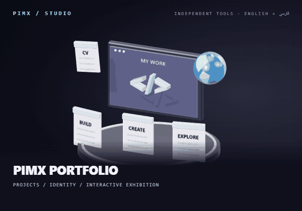
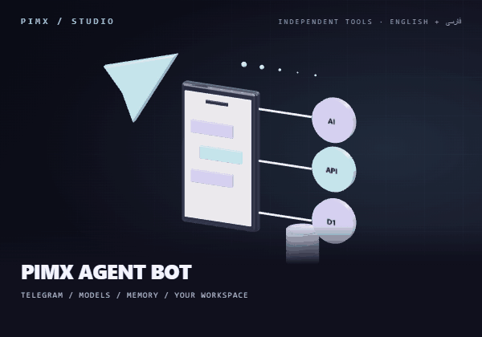
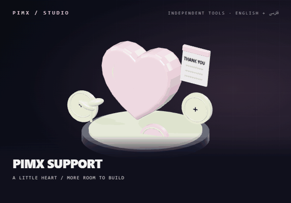

**[🌐 English](README.md) · [🇮🇷 فارسی](README.fa.md)**

[✨ Featured work](#featured) · [🚀 Current projects](#current) · [🧰 Toolkit](#toolkit) · [🤝 Connect](#connect)

# 👋 Hey, I'm Mohammadreza Abedinpoor.

I create **PIMX**: independent tools for **AI, the web, Windows and Telegram**. A mistyped sentence, a file that needs converting, a research workflow or a satellite orbit can all become the starting point for a project. I care about useful software with a visual identity of its own.

## 🌌 Three directions. One ecosystem.

|  **🧠 Intelligence** AI workspaces, conversations, research and useful artifacts. |  **⌨️ Engineering** Browser tools, Windows utilities and applications for real workflows. |  **🛰️ Exploration** Orbital data, weather, visual experiments and worlds in three dimensions. |
|:---:|:---:|:---:|

## 🆕 Fresh from my workspace

Three projects, three identities. Complete English and Persian guides, with a dedicated 3D scene for each.

|  **🌌 PIMX PORTFOLIO** My multilingual project exhibition: real previews, interactive 3D, CV and certificates. [📖 Explore project](https://github.com/MOHAMMADREZAABEDINPOOR/pimxportfolio) · [🌐 Open website](https://pimx.pages.dev/) |  **🤖 PIMX AGENT BOT** An AI workspace inside Telegram: providers, streamed chats, memory and portable archives. [📖 Explore project](https://github.com/MOHAMMADREZAABEDINPOOR/PIMX_AGENT_BOT) |  **💛 PIMX SUPPORT** A personal support page with an interactive heart, wallet search, copy and QR. [📖 Explore project](https://github.com/MOHAMMADREZAABEDINPOOR/PIMX_SUPPORT) |
|:---:|:---:|:---:|

## ✨ Featured projects

**20 live websites and web workspaces on Cloudflare.** Click a card to open the deployed experience. Public source repositories are linked separately below each card.

|  **PIMX AGENT / CHAT** Open the AI workspace for chat, research and creative work. <a href="https://chat.pimxagent.pages.dev">🌐 Open website</a> · <a href="https://github.com/MOHAMMADREZAABEDINPOOR/PIMX_AGENT">💻 Source</a> |  **PIMX AGENT** Explore PIMX Agent, its capabilities and the workspace. <a href="https://pimxagent.pages.dev">🌐 Open website</a> · <a href="https://github.com/MOHAMMADREZAABEDINPOOR/PIMX_AGENT">💻 Source</a> |
|:---:|:---:|
|  **PIMX / AI WORKSPACE** A browser workspace for conversations, capabilities and attachments. <a href="https://pimxagent.mohammadrezaabedinpoor6.workers.dev">🌐 Open website</a> |  **PIMX MORPH** Convert files with a browser-first format workflow. <a href="https://pimxmorph.pages.dev">🌐 Open website</a> · <a href="https://github.com/MOHAMMADREZAABEDINPOOR/PIMX_MORPH">💻 Source</a> |
|  **PIMX MOJI** Turn images into ASCII, emoji and character mosaics. <a href="https://pimxmoji.pages.dev">🌐 Open website</a> · <a href="https://github.com/MOHAMMADREZAABEDINPOOR/PIMX_MOJI">💻 Source</a> |  **PIMX NODE** Open the peer-to-peer file transfer workspace. <a href="https://pimxnode.pages.dev">🌐 Open website</a> · <a href="https://github.com/MOHAMMADREZAABEDINPOOR/PIMX_NODE">💻 Source</a> |
|  **PIMX VEIL** Encrypt a payload and place it inside a carrier file. <a href="https://pimxveil.pages.dev">🌐 Open website</a> · <a href="https://github.com/MOHAMMADREZAABEDINPOOR/PIMX_VEIL">💻 Source</a> |  **PIMX WIDE** Encrypt and decrypt text and files in the browser. <a href="https://pimxwide.pages.dev">🌐 Open website</a> · <a href="https://github.com/MOHAMMADREZAABEDINPOOR/PIMX_WIDE">💻 Source</a> |
|  **PIMX PASS / DNS** Explore DNS resolvers and browser-based timing comparisons. <a href="https://pimxpassdns.pages.dev">🌐 Open website</a> · <a href="https://github.com/MOHAMMADREZAABEDINPOOR/PIMX_PASS_DNS">💻 Source</a> |  **PIMX SATS** Explore satellites, orbital passes and the solar system. <a href="https://pimxsats.pages.dev">🌐 Open website</a> · <a href="https://github.com/MOHAMMADREZAABEDINPOOR/PIMXSATS">💻 Source</a> |
|  **PIMX WEATHER** A visual weather dashboard with forecasts and sky views. <a href="https://pimx-weather.pages.dev">🌐 Open website</a> · <a href="https://github.com/MOHAMMADREZAABEDINPOOR/PIMX_WEATHER">💻 Source</a> |  **PIMX FAIL** Browse startup stories, failure lessons and technical blueprints. <a href="https://pimxfail.pages.dev">🌐 Open website</a> · <a href="https://github.com/MOHAMMADREZAABEDINPOOR/PIMX_FAIL">💻 Source</a> |
|  **PIMX ELTEX** Explore AI videos, prompts and website-building projects. <a href="https://pimxeltex.pages.dev">🌐 Open website</a> · <a href="https://github.com/MOHAMMADREZAABEDINPOOR/PIMX_ELTEX">💻 Source</a> · <a href="https://pimx-eltex.mohammadrezaabedinpoor6.workers.dev">Workers</a> |  **PIMX PORTAL** Discover live PIMX tools from one ecosystem navigator. <a href="https://pimxportal.pages.dev">🌐 Open website</a> · <a href="https://github.com/MOHAMMADREZAABEDINPOOR/PIMX_PORTAL">💻 Source</a> |
|  **PIMX PORTFOLIO** My portfolio: projects, experiments and the story behind PIMX. <a href="https://pimx.pages.dev">🌐 Open website</a> · <a href="https://github.com/MOHAMMADREZAABEDINPOOR/pimxportfolio">💻 Source</a> |  **AMIRHOSSEINI / TRADE** A company website presenting import and export services. <a href="https://amirhosseini.pages.dev">🌐 Open website</a> · <a href="https://github.com/MOHAMMADREZAABEDINPOOR/Import-Export-Company">💻 Source</a> |
|  **I AM TEHRAN** A personal website for Tehran: biography, media and public presence. <a href="https://iamtehran.pages.dev">🌐 Open website</a> · <a href="https://github.com/MOHAMMADREZAABEDINPOOR/Tehran">💻 Source</a> |  **SOHEIL EGHTESADI** A personal website for investing, business coaching and marketing strategy. <a href="https://soheileghtesadi.pages.dev">🌐 Open website</a> |
|  **SOHEIL / LINKS** A bilingual link hub for Soheil’s social channels. <a href="https://soheileghtesadiportal.pages.dev">🌐 Open website</a> |  **CASPIAN / SAFETY** A business website for stair anti-slip products and safety equipment. <a href="https://caspianar.pages.dev">🌐 Open website</a> |

### ⌨️ PIMX SWAP — install it on Windows

`sghl` → `سلام`, locally on Windows. **[Download the installer](https://github.com/MOHAMMADREZAABEDINPOOR/PIMX_SWAP/releases/latest)**, choose your layouts and use the shortcuts. A local idle-tray measurement with the editor closed used about **13 MiB RAM**; the repository documents the measurement conditions.

## 🛠️ From an idea to a tool

| Step | What I care about |
|:---|:---|
| 💡 Idea | Start with a problem or something worth exploring. |
| 🎨 Design | Make the workflow and visual identity work together. |
| 🧑‍💻 Build | Choose tools that fit the browser, desktop, bot or backend. |
| 🔁 Refine | Improve behavior and make the project easier to understand. |

## 📊 A footprint of building

Actual GitHub contribution activity from October 8, 2025 to October 7, 2026. Each column represents a day; its height shows relative activity. This is a snapshot captured on **October 7, 2026**.

## 🧰 Tools behind the projects

These technologies appear in the repositories across this collection.

| Area | Technologies | Explore |
|:---|:---|:---|
| 🎨 Interfaces | TypeScript · React · Next.js · Vite · Tailwind CSS | [PIMX DASH](https://github.com/MOHAMMADREZAABEDINPOOR/PIMXDASH) |
| 🖥️ Desktop | Rust · Tauri · Windows APIs | [PIMX SWAP](https://github.com/MOHAMMADREZAABEDINPOOR/PIMX_SWAP) |
| ⚙️ Services | Node.js · Express · Python · Django · PHP · Laravel | [SHOP 02 / LARAVEL](https://github.com/MOHAMMADREZAABEDINPOOR/shop2) |
| ☁️ Edge & bots | Cloudflare Workers · Deno · Supabase · Telegram | [PIMX SONIC · V2](https://github.com/MOHAMMADREZAABEDINPOOR/PIMX_SONIC_BOT_V2) |
| 🗄️ Data | SQLite · PostgreSQL · Cloudflare D1 | [PIMX PLANNER](https://github.com/MOHAMMADREZAABEDINPOOR/PIMX_PLANNER) |
| 🪐 Browser capabilities | Three.js · Canvas · WebRTC · Web Crypto | [PIMX NODE](https://github.com/MOHAMMADREZAABEDINPOOR/PIMX_NODE) |

## 🚀 The current project directory

Published projects from my current workspace. Each repository has an English guide and a complete Persian edition.

| Project | What it does |
|:---|:---|
| 🌌 [PIMX PORTFOLIO](https://github.com/MOHAMMADREZAABEDINPOOR/pimxportfolio) | A ten-language personal project exhibition with dedicated 3D artwork, CV and credentials. |
| 🤖 [PIMX AGENT BOT](https://github.com/MOHAMMADREZAABEDINPOOR/PIMX_AGENT_BOT) | Telegram bot and Mini App with multi-provider AI, memory, streaming and portable archives. |
| 🧠 [PIMX AGENT](https://github.com/MOHAMMADREZAABEDINPOOR/PIMX_AGENT) | An AI workspace for conversations, research and document workflows. |
| ⌨️ [PIMX SWAP](https://github.com/MOHAMMADREZAABEDINPOOR/PIMX_SWAP) | Correct mistyped keyboard layouts on Windows, locally. |
| 🧩 [PIMX DASH](https://github.com/MOHAMMADREZAABEDINPOOR/PIMXDASH) | A new-tab workspace for bookmarks, search and focus. |
| 🔄 [PIMX MORPH](https://github.com/MOHAMMADREZAABEDINPOOR/PIMX_MORPH) | Convert images, PDFs, documents, audio and structured data. |
| 🎵 [PIMX SONIC · V2](https://github.com/MOHAMMADREZAABEDINPOOR/PIMX_SONIC_BOT_V2) | A Supabase Edge Function for Telegram media-link workflows. |
| 🛍️ [SHOP 02 / LARAVEL](https://github.com/MOHAMMADREZAABEDINPOOR/shop2) | A Laravel storefront with product variants, carts and role-based administration. |
| 📉 [PIMX FAIL](https://github.com/MOHAMMADREZAABEDINPOOR/PIMX_FAIL) | Discover failed startups, their stories and lessons. |
| 🔗 [PIMX NODE](https://github.com/MOHAMMADREZAABEDINPOOR/PIMX_NODE) | Encrypted peer-to-peer file transfer through WebRTC. |
| 🎨 [PIMX MOJI](https://github.com/MOHAMMADREZAABEDINPOOR/PIMX_MOJI) | Turn images into character art inside the browser. |
| 🫥 [PIMX VEIL](https://github.com/MOHAMMADREZAABEDINPOOR/PIMX_VEIL) | Encrypt a payload and append it to a carrier file. |
| 🔐 [PIMX WIDE](https://github.com/MOHAMMADREZAABEDINPOOR/PIMX_WIDE) | Browser-based text and file encryption with Web Crypto. |
| 🌐 [PIMX PASS DNS](https://github.com/MOHAMMADREZAABEDINPOOR/PIMX_PASS_DNS) | Compare curated DNS resolvers with browser timing tests. |
| 🛡️ [PIMX PASS PANEL](https://github.com/MOHAMMADREZAABEDINPOOR/PIMX_PASS_PANEL) | Manage a Cloudflare Worker proxy and subscriptions. |
| 🗓️ [PIMX PLANNER](https://github.com/MOHAMMADREZAABEDINPOOR/PIMX_PLANNER) | A workspace for tasks, goals, study tracking and a diary. |
| 🎬 [PIMX ELTEX](https://github.com/MOHAMMADREZAABEDINPOOR/PIMX_ELTEX) | Publish AI-building episodes, code and project previews. |
| 🚀 [PIMX](https://github.com/MOHAMMADREZAABEDINPOOR/PIMX) | The home of independent tools in the PIMX ecosystem. |
| 💛 [PIMX SUPPORT](https://github.com/MOHAMMADREZAABEDINPOOR/PIMX_SUPPORT) | A bilingual donation page for supporting the ecosystem. |
| 👨‍💻 [PERSONAL WEBSITE](https://github.com/MOHAMMADREZAABEDINPOOR/personal-website) | A personal website with projects, certificates and locale content. |
| 🚢 [IMPORT / EXPORT](https://github.com/MOHAMMADREZAABEDINPOOR/Import-Export-Company) | A multi-page import/export company website. |
| 🌤️ [PIMX WEATHER](https://github.com/MOHAMMADREZAABEDINPOOR/PIMX_WEATHER) | Weather, forecasts and astronomical visualizations. |
| 📶 [PIMX PASS BOT](https://github.com/MOHAMMADREZAABEDINPOOR/PIMX_PASS_BOT) | Telegram tools for finding and testing network configurations. |
| 👛 [MML WALLET](https://github.com/MOHAMMADREZAABEDINPOOR/mml-wallet) | A Telegram wallet workflow with SQLite persistence. |
| 🎮 [PIMX PLAY BOT](https://github.com/MOHAMMADREZAABEDINPOOR/PIMX_PLAY_BOT) | Discover applications and browse results in Telegram. |
| 🎧 [PIMX SONIC](https://github.com/MOHAMMADREZAABEDINPOOR/PIMX_SONIC_BOT) | A Python music and media bot for Telegram. |
| 📱 [PIMX CHAT PWA](https://github.com/MOHAMMADREZAABEDINPOOR/pwa-chatbot) | A Node/Express chat workspace with localized web pages. |
| 📬 [EMAIL GENERATOR](https://github.com/MOHAMMADREZAABEDINPOOR/email-generator) | Create temporary inboxes, watch messages and extract codes. |
| 🛒 [SHOP / DJANGO](https://github.com/MOHAMMADREZAABEDINPOOR/shop) | A Django storefront with carts, stock-aware orders and a payment sandbox. |
| 📦 [SHOP 03 / PHP](https://github.com/MOHAMMADREZAABEDINPOOR/shop3) | A compact PHP/SQLite storefront with customer and admin pages. |
| ✨ [TELEGRAM / GEMINI](https://github.com/MOHAMMADREZAABEDINPOOR/telegram-bot) | A compact Telegram assistant connected to Gemini. |

🌠 More corners of the PIMX universe

| Project | Focus |
|:---|:---|
| 🛰️ [PIMX SATS](https://github.com/MOHAMMADREZAABEDINPOOR/PIMXSATS) | An interactive satellite and solar-system explorer. A Three.js globe, satellite.js orbit propagation and pass predictions turn orbital data into a visual workspace. |
| 📡 [PIMX PERSONAL](https://github.com/MOHAMMADREZAABEDINPOOR/PIMX_PERSONAL) | A React server-discovery dashboard with a Node backend for collecting, testing and listing proxy/server configurations. The source is a network tool despite the repository name. |
| 🌀 [PIMX PORTAL](https://github.com/MOHAMMADREZAABEDINPOOR/PIMX_PORTAL) | A bilingual visual directory for the PIMX ecosystem. Distinct project posters lead visitors to individual tools and a support destination. |
| 🪐 [SPATIAL PORTFOLIO](https://github.com/MOHAMMADREZAABEDINPOOR/3d-animated-interactive-portfolio) | A personal portfolio pairing a React Three Fiber frontend with an Express project API. Three.js scenes and Framer Motion transitions frame the project showcase. |
| 🏙️ [TEHRAN](https://github.com/MOHAMMADREZAABEDINPOOR/Tehran) | A static cultural/media website with multiple editorial pages, embedded video content and a dark visual theme. |
| 🤖 [PIMX EDGE BOT](https://github.com/MOHAMMADREZAABEDINPOOR/BOT) | A Telegram AI assistant implemented as a Cloudflare Worker, with provider routing, chat memory, reminders and per-user timezone helpers. |
| 🏡 [PROPERTY DISCOVERY BOT](https://github.com/MOHAMMADREZAABEDINPOOR/telegram-web-scraping-bot) | A collection of Telegram and agent scripts for property-listing discovery, with Agno/Gemini integration and Scrapling extraction helpers. |
| 💬 [PIMX CHAT · DJANGO](https://github.com/MOHAMMADREZAABEDINPOOR/chat) | A Django chat application with account management, persisted conversations, static assets and an AI response integration. |

🎓 Earlier experiments & the learning archive

The earlier chapters: Python, C++, databases, web exercises and Git course work.

| Repository | Focus |
|:---|:---|
| 🎲 [gussing-number](https://github.com/MOHAMMADREZAABEDINPOOR/gussing-number) | A console guessing game that chooses a number from 1 to 10 and records the best attempt count during the current session. |
| 🎯 [gussing-number-with-js](https://github.com/MOHAMMADREZAABEDINPOOR/gussing-number-with-js) | A small browser game with a random answer in the range 0–999, higher/lower hints and ten incorrect-guess opportunities. |
| 🕰️ [clock](https://github.com/MOHAMMADREZAABEDINPOOR/clock) | A Tkinter digital clock that updates its time label every 200 milliseconds. |
| ♟️ [chess-timer-with-python](https://github.com/MOHAMMADREZAABEDINPOOR/chess-timer-with-python) | A Tkinter exercise with separate player counters and buttons for switching between players. |
| 🌡️ [temperuture](https://github.com/MOHAMMADREZAABEDINPOOR/temperuture) | A simulated temperature controller with increase/decrease buttons and heater/cooler status labels. |
| 🌡️ [thermometer](https://github.com/MOHAMMADREZAABEDINPOOR/thermometer) | A reusable Tkinter thermometer class demonstrated with two independent panels. |
| ⏳ [time-with-tkinter-library](https://github.com/MOHAMMADREZAABEDINPOOR/time-with-tkinter-library) | A Tkinter countdown exercise with hour, minute and second fields and an expiration dialog. |
| ⏱️ [timer-with-threading-library](https://github.com/MOHAMMADREZAABEDINPOOR/timer-with-threading-library) | A Tkinter/threading exercise with two independently started countdown counters. |
| 🪟 [open-random-window](https://github.com/MOHAMMADREZAABEDINPOOR/open-random-window) | A small Tkinter experiment that creates ten windows with randomized sizes and positions. |
| 🐢 [turtle-library](https://github.com/MOHAMMADREZAABEDINPOOR/turtle-library) | A collection of introductory Python scripts: one console input exercise and five turtle drawing experiments built from repeated forward/turn commands. |
| 📝 [c-mn](https://github.com/MOHAMMADREZAABEDINPOOR/c-mn) | A C++ console program that reads whitespace-delimited text and writes each value to a file until the user enters exit. |
| 🧮 [my-project](https://github.com/MOHAMMADREZAABEDINPOOR/my-project) | An early C++ file-I/O exercise that accepts integers until zero, writes nonzero values and prints the input count. |
| 🔢 [cpp](https://github.com/MOHAMMADREZAABEDINPOOR/cpp) | A C++ program that reads a 3×3 integer matrix, separates its columns into arrays and prints column values in sequence. |
| 📒 [exam](https://github.com/MOHAMMADREZAABEDINPOOR/exam) | A forked C++ exercise that experiments with username input and file persistence. It is preserved as a learning snapshot with upstream attribution. |
| 🗄️ [sqlalchemy](https://github.com/MOHAMMADREZAABEDINPOOR/sqlalchemy) | Four Python ORM exercises demonstrate insertion, selection, update and deletion against a MySQL table. |
| 🖱️ [spam-with-pyautogui](https://github.com/MOHAMMADREZAABEDINPOOR/spam-with-pyautogui) | A short PyAutoGUI experiment that sends a fixed sequence of Windows keyboard events after timed delays. |
| 🎓 [coursera](https://github.com/MOHAMMADREZAABEDINPOOR/coursera) | A small collection of HTML/CSS course work with a root page and a module3-solution directory. |
| 🌱 [test](https://github.com/MOHAMMADREZAABEDINPOOR/test) | A course assignment repository with a shell simple-interest calculator and contribution/community files. |
| 🍴 [mcino-Introduction-to-Git-and-GitHub](https://github.com/MOHAMMADREZAABEDINPOOR/mcino-Introduction-to-Git-and-GitHub) | A forked Git/GitHub course repository with interest-calculator exercises and upstream community documents. |
| 📚 [Web-Application-Technologies-and-Django-Coursera](https://github.com/MOHAMMADREZAABEDINPOOR/Web-Application-Technologies-and-Django-Coursera) | A forked course-material archive organized by Week 1 through Week 5 for Web Application Technologies and Django. |

## 🤝 Build something better together

Have an idea, feedback or a reproducible bug? Open an issue in the relevant repository. You can also explore PIMX SUPPORT to support the ecosystem.

| Connect | Where |
|:---|:---|
| 💻 GitHub | [@MOHAMMADREZAABEDINPOOR](https://github.com/MOHAMMADREZAABEDINPOOR) |
| 🚀 PIMX | [Ecosystem](https://github.com/MOHAMMADREZAABEDINPOOR/PIMX) |
| 💛 Support | [PIMX SUPPORT](https://github.com/MOHAMMADREZAABEDINPOOR/PIMX_SUPPORT) |

**[English](README.md) · [فارسی](README.fa.md)** · [Static poster](assets/readme/profile-hero.png)

