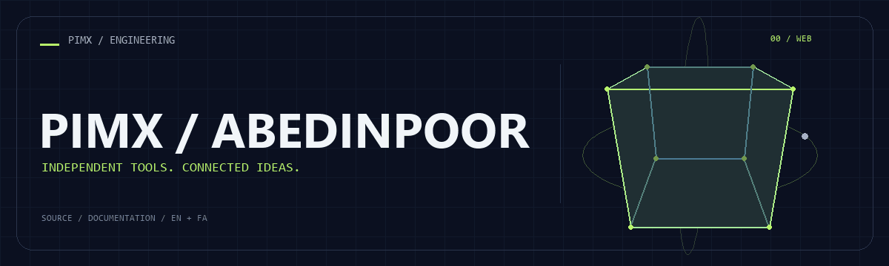
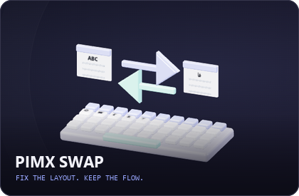
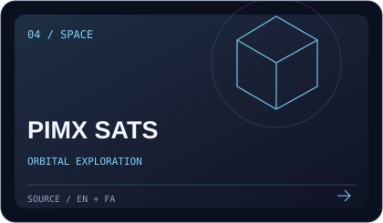
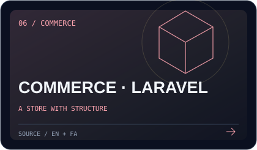

**[English](README.md) · [فارسی](README.fa.md)**

[Explore my repositories](https://github.com/MOHAMMADREZAABEDINPOOR?tab=repositories) · [PIMX](https://github.com/MOHAMMADREZAABEDINPOOR/PIMX) · [Project directory](https://github.com/MOHAMMADREZAABEDINPOOR/PIMX_PORTAL)

# Mohammadreza Abedinpoor

I build **PIMX**: independent tools spanning AI workspaces, the web, Windows desktop utilities, Telegram bots and interactive 3D experiences. This page is a gateway to my repositories, each with English and Persian documentation.

## What I build

- AI workspaces that connect conversations, research and artifacts.
- Practical tools for file conversion, keyboard correction and browser workflows.
- Visual experiences for exploring satellites, weather and independent projects.

## Selected projects

|  |  |
|:---:|:---:|
|  |  |
|  |  |

## The toolkit

Technologies used across the repositories in this collection:

## Project index

### AI & Telegram

| Repository | Purpose |
|---|---|
| [PIMX_AGENT](https://github.com/MOHAMMADREZAABEDINPOOR/PIMX_AGENT) | A Next.js AI workspace with provider configuration, conversations, attachments, project/library organization, research tools and document/presentation workflows. |
| [PIMX_ELTEX](https://github.com/MOHAMMADREZAABEDINPOOR/PIMX_ELTEX) | A Next.js publishing platform for AI-building episodes, code resources and project previews, with member accounts, comments and an administrative console. |
| [BOT](https://github.com/MOHAMMADREZAABEDINPOOR/BOT) | A Telegram AI assistant implemented as a Cloudflare Worker, with provider routing, chat memory, reminders and per-user timezone helpers. |
| [PIMX_PASS_BOT](https://github.com/MOHAMMADREZAABEDINPOOR/PIMX_PASS_BOT) | A Telegram bot and companion web interface for finding, parsing and testing network/server configurations |
| [mml-wallet](https://github.com/MOHAMMADREZAABEDINPOOR/mml-wallet) | A Telegram wallet/collection bot with asynchronous SQLite storage, configurable administrative settings, a keep-alive helper and a Flask database viewer. |
| [PIMX_PLAY_BOT](https://github.com/MOHAMMADREZAABEDINPOOR/PIMX_PLAY_BOT) | A Python Telegram application-discovery bot with provider queries, result matching, interactive keyboards and temporary-file delivery helpers. |
| [PIMX_SONIC_BOT](https://github.com/MOHAMMADREZAABEDINPOOR/PIMX_SONIC_BOT) | A Python Telegram music/media bot using yt-dlp, asynchronous HTTP, inline controls and local persistence helpers. |
| [telegram-web-scraping-bot](https://github.com/MOHAMMADREZAABEDINPOOR/telegram-web-scraping-bot) | A collection of Telegram and agent scripts for property-listing discovery, with Agno/Gemini integration and Scrapling extraction helpers. |
| [pwa-chatbot](https://github.com/MOHAMMADREZAABEDINPOOR/pwa-chatbot) | A Node/Express AI-chat project with a companion pimxchat web directory, localized pages and SQLite persistence helpers. |
| [chat](https://github.com/MOHAMMADREZAABEDINPOOR/chat) | A Django chat application with account management, persisted conversations, static assets and an AI response integration. |
| [email-generator](https://github.com/MOHAMMADREZAABEDINPOOR/email-generator) | A terminal tool for creating temporary inboxes through temp-mail.io, monitoring messages with background threads and extracting likely verification codes. |
| [PIMX_SONIC_BOT_V2](https://github.com/MOHAMMADREZAABEDINPOOR/PIMX_SONIC_BOT_V2) | A TypeScript/Deno Telegram media bot deployed as a Supabase Edge Function |
| [telegram-bot](https://github.com/MOHAMMADREZAABEDINPOOR/telegram-bot) | A compact Telegram long-polling bot that sends user text to the Gemini REST API and applies a system prompt loaded from a local text file. |

### Web & utility projects

| Repository | Purpose |
|---|---|
| [PIMX_FAIL](https://github.com/MOHAMMADREZAABEDINPOOR/PIMX_FAIL) | A searchable archive of failed startups with company stories, failure lessons, technical blueprints and an optional Gemini analysis endpoint. |
| [PIMX_NODE](https://github.com/MOHAMMADREZAABEDINPOOR/PIMX_NODE) | A browser file-transfer workspace built around WebRTC data channels, a Node.js WebSocket signaling service and AES-GCM encryption of transferred chunks. |
| [PIMX_MOJI](https://github.com/MOHAMMADREZAABEDINPOOR/PIMX_MOJI) | A browser image-to-character art studio with preset styles, a character picker, canvas processing, previews and conversion history. |
| [PIMX_MORPH](https://github.com/MOHAMMADREZAABEDINPOOR/PIMX_MORPH) | A browser conversion workbench for images, PDFs, documents, audio and structured data |
| [PIMX_PASS_DNS](https://github.com/MOHAMMADREZAABEDINPOOR/PIMX_PASS_DNS) | A bilingual DNS comparison interface with curated resolver sources, browser-based timing tests, result cards and an optional analytics backend. |
| [PIMX_PERSONAL](https://github.com/MOHAMMADREZAABEDINPOOR/PIMX_PERSONAL) | A React server-discovery dashboard with a Node backend for collecting, testing and listing proxy/server configurations |
| [PIMX_PLANNER](https://github.com/MOHAMMADREZAABEDINPOOR/PIMX_PLANNER) | A personal planning workspace with daily tasks, goals, study tracking, grades, reminders, a diary and a chat section |
| [PIMX](https://github.com/MOHAMMADREZAABEDINPOOR/PIMX) | The PIMX ecosystem website: a React/TypeScript showcase connecting independent web tools, AI projects and personal engineering work, with a Node server and Pages… |
| [PIMX_PORTAL](https://github.com/MOHAMMADREZAABEDINPOOR/PIMX_PORTAL) | A bilingual visual directory for the PIMX ecosystem |
| [PIMX_SUPPORT](https://github.com/MOHAMMADREZAABEDINPOOR/PIMX_SUPPORT) | A bilingual donation page for PIMX with cryptocurrency network cards, wallet addresses and receipt-style detail dialogs. |
| [personal-website](https://github.com/MOHAMMADREZAABEDINPOOR/personal-website) | A static personal website with project sections, certificate assets, locale data, search-engine metadata and a service worker. |
| [Import-Export-Company](https://github.com/MOHAMMADREZAABEDINPOOR/Import-Export-Company) | A multi-page corporate website for an import/export company, implemented with HTML, CSS and JavaScript |
| [Tehran](https://github.com/MOHAMMADREZAABEDINPOOR/Tehran) | A static cultural/media website with multiple editorial pages, embedded video content and a dark visual theme. |
| [PIMXDASH](https://github.com/MOHAMMADREZAABEDINPOOR/PIMXDASH) | A Manifest V3 Chrome/Chromium new-tab extension centered on bookmarks, fast search, focus tools and modular productivity widgets. |
| [PIMX_SWAP](https://github.com/MOHAMMADREZAABEDINPOOR/PIMX_SWAP) | A local Windows keyboard-layout correction utility built with Rust, Tauri 2, React and TypeScript |

### Space & visual experiences

| Repository | Purpose |
|---|---|
| [PIMXSATS](https://github.com/MOHAMMADREZAABEDINPOOR/PIMXSATS) | An interactive satellite and solar-system explorer |
| [3d-animated-interactive-portfolio](https://github.com/MOHAMMADREZAABEDINPOOR/3d-animated-interactive-portfolio) | A personal portfolio pairing a React Three Fiber frontend with an Express project API |
| [PIMX_WEATHER](https://github.com/MOHAMMADREZAABEDINPOOR/PIMX_WEATHER) | A vanilla JavaScript weather dashboard with forecast views, localization, animated styling and astronomical/solar visualizations. |

### Privacy & networking

| Repository | Purpose |
|---|---|
| [PIMX_VEIL](https://github.com/MOHAMMADREZAABEDINPOOR/PIMX_VEIL) | A browser workbench that encrypts a payload and appends it, together with metadata, to a carrier file |
| [PIMX_WIDE](https://github.com/MOHAMMADREZAABEDINPOOR/PIMX_WIDE) | A multilingual text/file encryption interface using browser Web Crypto, AES-256-GCM and password-derived keys, with local records and optional visitor telemetry. |
| [PIMX_PASS_PANEL](https://github.com/MOHAMMADREZAABEDINPOOR/PIMX_PASS_PANEL) | A Cloudflare Worker with a Persian management interface, KV-backed state, subscription generation and WebSocket-to-TCP proxy handling. |

### Commerce

| Repository | Purpose |
|---|---|
| [shop](https://github.com/MOHAMMADREZAABEDINPOOR/shop) | A Django ecommerce application with product variants, guest/customer carts, inventory-aware order creation, a local payment sandbox and an operations dashboard. |
| [shop2](https://github.com/MOHAMMADREZAABEDINPOOR/shop2) | A Laravel 13 ecommerce application with an Alpine.js/Tailwind frontend, product variants, customer accounts, carts, orders and role-based administrative workflows. |
| [shop3](https://github.com/MOHAMMADREZAABEDINPOOR/shop3) | A framework-free PHP storefront with a small MVC/router layer, SQLite initialization, customer/admin pages and bilingual product content. |

### Learning archive

| Repository | Purpose |
|---|---|
| [gussing-number](https://github.com/MOHAMMADREZAABEDINPOOR/gussing-number) | A console guessing game that chooses a number from 1 to 10 and records the best attempt count during the current session. |
| [gussing-number-with-js](https://github.com/MOHAMMADREZAABEDINPOOR/gussing-number-with-js) | A small browser game with a random answer in the range 0–999, higher/lower hints and ten incorrect-guess opportunities. |
| [clock](https://github.com/MOHAMMADREZAABEDINPOOR/clock) | A Tkinter digital clock that updates its time label every 200 milliseconds. |
| [chess-timer-with-python](https://github.com/MOHAMMADREZAABEDINPOOR/chess-timer-with-python) | A Tkinter exercise with separate player counters and buttons for switching between players. |
| [temperuture](https://github.com/MOHAMMADREZAABEDINPOOR/temperuture) | A simulated temperature controller with increase/decrease buttons and heater/cooler status labels. |
| [thermometer](https://github.com/MOHAMMADREZAABEDINPOOR/thermometer) | A reusable Tkinter thermometer class demonstrated with two independent panels. |
| [time-with-tkinter-library](https://github.com/MOHAMMADREZAABEDINPOOR/time-with-tkinter-library) | A Tkinter countdown exercise with hour, minute and second fields and an expiration dialog. |
| [timer-with-threading-library](https://github.com/MOHAMMADREZAABEDINPOOR/timer-with-threading-library) | A Tkinter/threading exercise with two independently started countdown counters. |
| [open-random-window](https://github.com/MOHAMMADREZAABEDINPOOR/open-random-window) | A small Tkinter experiment that creates ten windows with randomized sizes and positions. |
| [turtle-library](https://github.com/MOHAMMADREZAABEDINPOOR/turtle-library) | A collection of introductory Python scripts: one console input exercise and five turtle drawing experiments built from repeated forward/turn commands. |
| [c-mn](https://github.com/MOHAMMADREZAABEDINPOOR/c-mn) | A C++ console program that reads whitespace-delimited text and writes each value to a file until the user enters exit. |
| [my-project](https://github.com/MOHAMMADREZAABEDINPOOR/my-project) | An early C++ file-I/O exercise that accepts integers until zero, writes nonzero values and prints the input count. |
| [cpp](https://github.com/MOHAMMADREZAABEDINPOOR/cpp) | A C++ program that reads a 3×3 integer matrix, separates its columns into arrays and prints column values in sequence. |
| [exam](https://github.com/MOHAMMADREZAABEDINPOOR/exam) | A forked C++ exercise that experiments with username input and file persistence |
| [sqlalchemy](https://github.com/MOHAMMADREZAABEDINPOOR/sqlalchemy) | Four Python ORM exercises demonstrate insertion, selection, update and deletion against a MySQL table. |
| [spam-with-pyautogui](https://github.com/MOHAMMADREZAABEDINPOOR/spam-with-pyautogui) | A short PyAutoGUI experiment that sends a fixed sequence of Windows keyboard events after timed delays. |
| [coursera](https://github.com/MOHAMMADREZAABEDINPOOR/coursera) | A small collection of HTML/CSS course work with a root page and a module3-solution directory. |
| [test](https://github.com/MOHAMMADREZAABEDINPOOR/test) | A course assignment repository with a shell simple-interest calculator and contribution/community files. |
| [mcino-Introduction-to-Git-and-GitHub](https://github.com/MOHAMMADREZAABEDINPOOR/mcino-Introduction-to-Git-and-GitHub) | A forked Git/GitHub course repository with interest-calculator exercises and upstream community documents. |
| [Web-Application-Technologies-and-Django-Coursera](https://github.com/MOHAMMADREZAABEDINPOOR/Web-Application-Technologies-and-Django-Coursera) | A forked course-material archive organized by Week 1 through Week 5 for Web Application Technologies and Django. |

## About these repositories

English is the default README language; the link at the top opens the Persian edition. Project descriptions follow the repository source, including learning snapshots and forks. Check each repository for its setup, limitations and actual license terms.

## Connect & contribute

For suggestions or bug reports, open an issue in the relevant repository with clear reproduction steps. To support the ecosystem, visit [PIMX SUPPORT](https://github.com/MOHAMMADREZAABEDINPOOR/PIMX_SUPPORT).

---

**Build. Learn. Refine.** · [Static artwork](assets/readme/hero.png)
